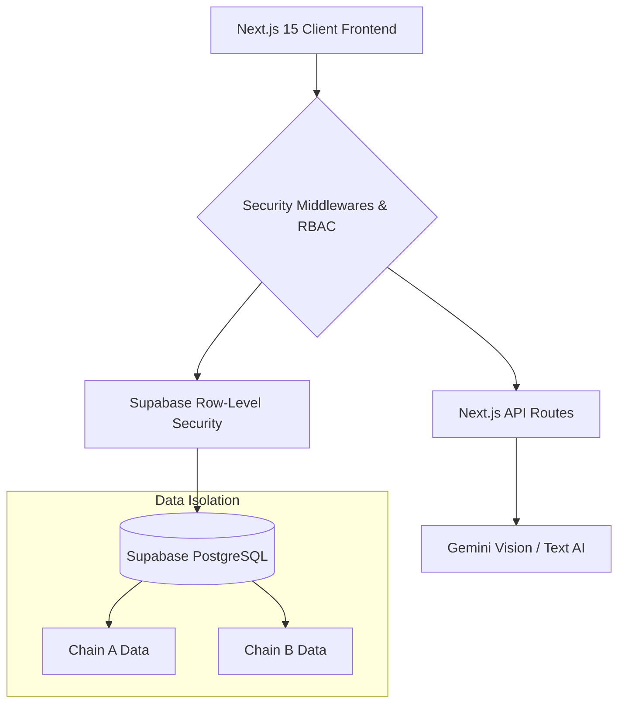

<div align="center">
  <h1>PharmaNile</h1>
  <p><strong>Premium Multi-Tenant Pharmacy Management OS</strong></p>
  
  [](https://nextjs.org/)
  [](https://supabase.com/)
  [](https://www.typescriptlang.org/)
  [](https://tailwindcss.com/)
  
  <br />
  <p><em>Enterprise-grade, AI-powered system designed for the Egyptian pharmaceutical market.</em></p>
</div>

---

## Overview

**PharmaNile** is a full-stack, state-of-the-art pharmacy management system. It supports multiple pharmacy chains (سلاسل صيدليات), each with multiple branches (فروع), providing a unified point of sale, detailed inventory management, and robust financial reporting.

### Key Features

* **Offline-First POS**: Point of Sale system with barcode scanning, auto-queue, and background network recovery. 
* **Multi-tier Architecture**: Chains, Branches, and Role-Based Access Controls (مدير السلسلة، مدير الصيدلية، الخ).
* **Inventory Lifecycle**: Bulk imports, expiry tracking, low-stock warnings, and inter-branch `transfers`.
* **Comprehensive Billing**: Integrated purchases (`invoices`), returns, supplier debts, and patient profiles.
* **Gemini AI Integration**: Auto-fill product catalogs, parse physical invoices via OCR, analyze product images, and interact with an AI Copilot.
* **Premium UI System**: Dynamic Glassmorphism themes stripped of overly flashy distractions for a mature, enterprise feel.

---

## Architecture



> [!NOTE] 
> The system utilizes a strict Multi-Chain Data Isolation. `chain_admin` users manage their networks, while `admin` users handle branch-specific operations. Data never crosses boundaries thanks to Supabase Row Level Security (RLS) policies.

---

## Security & Role-Based Access Control (RBAC)

PharmaNile restricts functionality explicitly based on user privileges, enforcing rules on both the Edge network (Next.js Middleware) and at the database level.

| Role | Arabic Equivalent | Access Restrictions |
|------|-------------------|---------------------|
| `chain_admin` | مدير السلسلة | Cannot view pharmacy-specific data; restricted to chain management across branches. |
| `admin` | مدير الصيدلية | Complete unfettered access to their assigned pharmacy branch. |
| `manager` | مشرف | Allowed to view `Settings`, `Financials`, and manage `Staff`. |
| `staff` | موظف | Restricted to `Inventory`, `POS`, and basic day-to-day operations. Blocked from sensitive routes. |

> [!IMPORTANT]
> The database enforces strict RLS. If a user attempts to bypass the middleware, the database itself will return `0 rows` for unauthorized pharmacy data.

---

## Folder Structure

```tree
src/
├── app/                    # Next.js App Router
│   ├── auth/               # Login, Branch Selection, Registration
│   ├── pos/                # Local-First Offline Point of Sale
│   ├── inventory/          # Drug Stock & Expiry Control
│   ├── financials/         # Restricted: Financial Overviews
│   └── (other modules)     # Staff, Transfers, Shortages, Customers
├── components/
│   ├── layout/             # Enterprise Sidebar & RBAC Nav
│   ├── modules/            # Domain Driven Components
│   └── ui/                 # Core Glassmorphic System
├── hooks/                  # Auth Management, Preferences, Local Storage
├── lib/                    # Supabase Clients, Offline Queues, Utility funcs
└── store/                  # Redux State (Agent & Notification Control)
```

> For extended API endpoints, documentation, and specific schema setups, reference `docs/PROJECT.md`.

---

## Quick Start

### 1. Requirements

Ensure you have **Node.js (v18+)** and a configured **Supabase** instance. You will also need a Google Gemini API Key for the AI feature set.

### 2. Environment Setup

Create a `.env.local` file in the root directory:

```env
NEXT_PUBLIC_SUPABASE_URL=https://<your-project>.supabase.co
NEXT_PUBLIC_SUPABASE_ANON_KEY=...
SUPABASE_SERVICE_ROLE_KEY=...
GEMINI_API_KEY=...
```

### 3. Installation

```bash
# Install dependencies
npm install

# Run the development server
npm run dev
```

Visit [http://localhost:3000](http://localhost:3000) to view the client. 

---

## Specialized Documentation

For deep technical dives, refer to the files housed in the `docs/` folder:

* [PROJECT.md](docs/PROJECT.md): Full database schema and multi-chain architecture specifics.
* [SECURITY_GUIDANCE.md](docs/SECURITY_GUIDANCE.md): Information on SQL injections, XSS defense, CSRF, and RBAC strategies.
* [DEPLOYMENT.md](docs/DEPLOYMENT.md): Strategies for CI/CD and shipping to Vercel/Supabase.
* [REDIS_INTEGRATION.md](docs/REDIS_INTEGRATION.md): Caching specs.
* [TECHNICAL_REFERENCE.txt](docs/TECHNICAL_REFERENCE.txt): Complete historical context logs and fix patches.

---

<p align="center">
  <i>Built for scale. Secured by default.</i>
</p>
